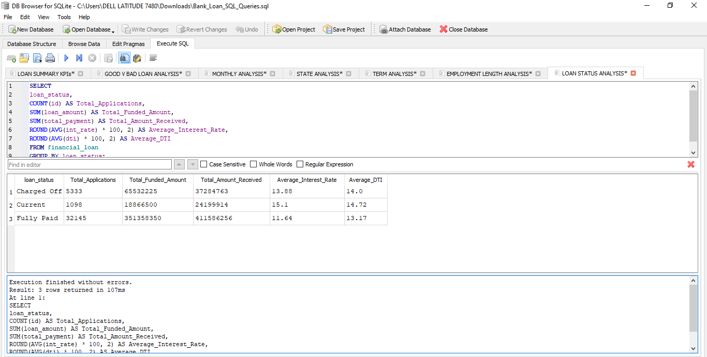
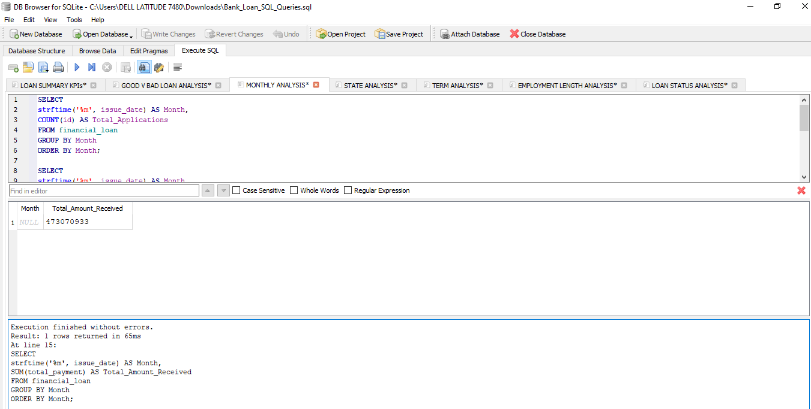
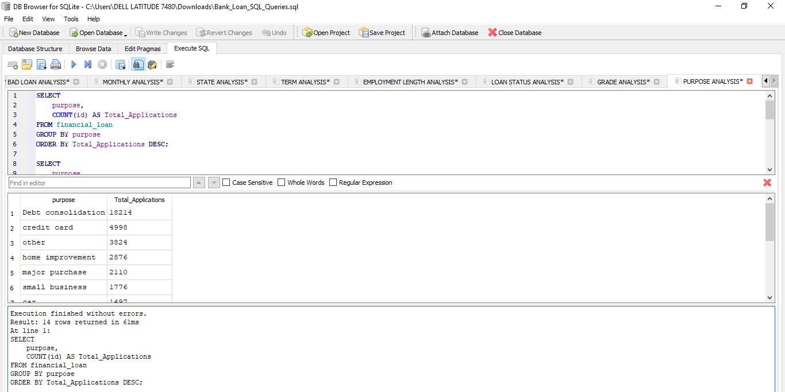
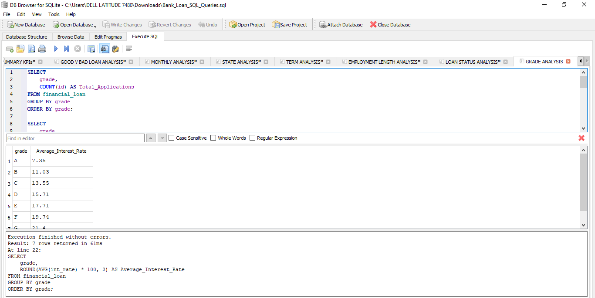
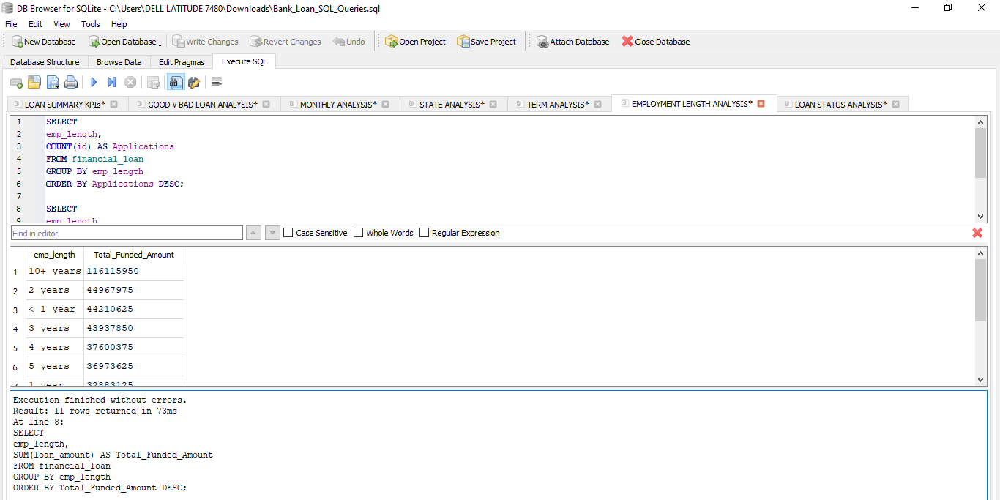
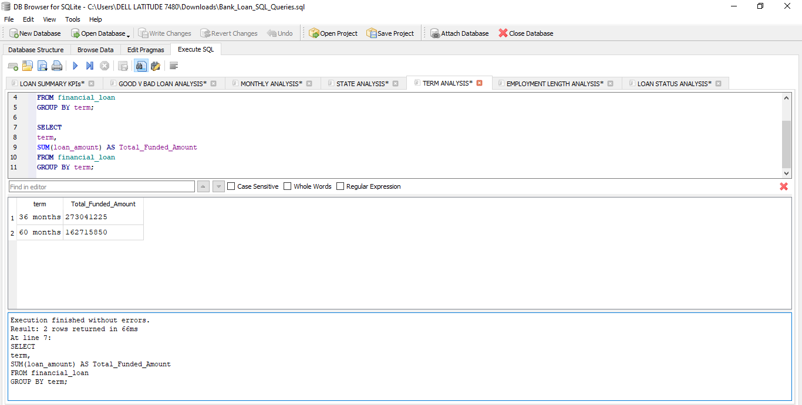

#  Bank Loan Analysis SQL Project

## Overview

A comprehensive SQL analysis of 38,576 bank loan records using SQLite to uncover insights into loan performance, borrower behavior, repayment trends, and lending patterns. This project supports data-driven decision-making and complements the Power BI dashboard.

---

## SQL Query Screenshots

The following SQL queries were used to analyze the Financial Loan dataset.

### Loan Status Analysis
- Analyzes loan applications, funded amount, and amount received by loan status.
- 
 
### State Analysis
- Examines loan applications, funded amount, and repayments across different states.
- 

### Monthly Trend Analysis
- Tracks monthly loan applications, funded amount, and repayments.
- 

### Purpose Analysis
- Explores customer borrowing purposes through SQL analysis.
- 

### Grade Analysis
- Evaluates loan performance across different credit grades.
- 

### Employment Length Analysis
- Analyzes loan performance based on borrowers' employment length.
- 
  
### Term Analysis
- Compares loan performance between 36-month and 60-month loan terms.
- 
---

## Objectives

- Analyze bank loan data using SQL.
- Evaluate loan performance across key business dimensions.
- Identify trends and borrower behavior.
- Generate insights to support business decisions.

---

## Tools Used

- SQL (SQLite)
- DB Browser for SQLite
- Microsoft Excel (Data Preparation)

---

## Dataset

- **Records:** 38,576
- **Columns:** 23
- **Source:** Financial Loan Dataset

---

## Business Questions Answered

- What is the distribution of loans by loan status?
- Which states have the highest loan activity?
- How do loan applications change over time?
- What are the most common loan purposes?
- Which loan grades receive the most applications?
- Does employment length influence loan applications?
- Which loan term is most preferred?

---

## Key Insights

- Good loans accounted for the majority of the loan portfolio.
- Loan demand varied across months, indicating seasonal trends.
- Some states recorded significantly higher loan activity.
- Borrowers with longer employment history generally had higher loan activity.
- Grade B loans represented a large share of lending activity.
- The 36-month loan term was the most common.
- Debt consolidation and credit card refinancing were among the leading loan purposes.

---

## Business Recommendations

- Increase marketing efforts in high-performing states.
- Strengthen risk assessment for higher-risk loan grades.
- Develop targeted loan products based on customer borrowing purposes.
- Monitor monthly lending trends to improve forecasting.
- Continue tracking repayment performance to reduce default risk.

---

## Recommendations Based on Findings

- Improve credit evaluation for higher-risk borrowers.
- Offer personalized loan products based on customer needs.
- Focus retention strategies on borrowers with strong repayment history.
- Use SQL and Power BI dashboards for continuous loan portfolio monitoring.

## Related Project

- **Bank Loan Analysis Dashboard (Power BI)**

---

## Conclusion

This project demonstrates my ability to write SQL queries, analyze financial data, answer business questions, and generate actionable insights that support business intelligence and decision-making.
